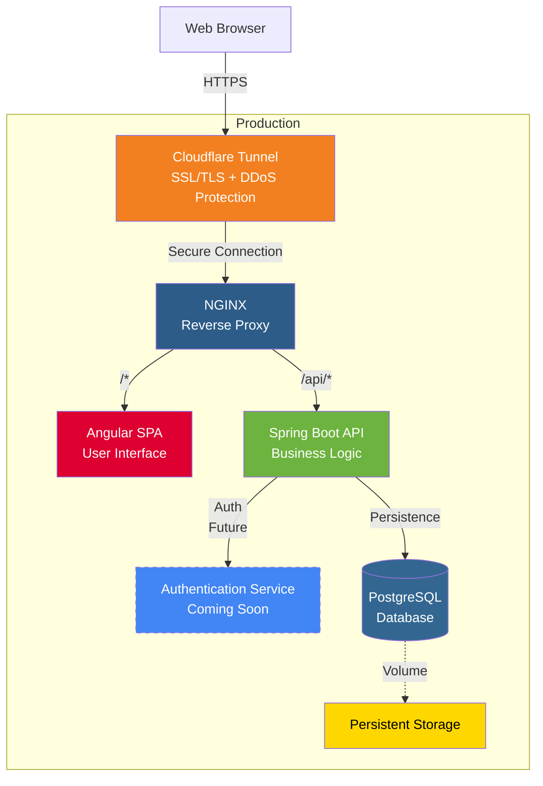

# Portfolio Application

Full-stack web application with Angular, Spring Boot, and PostgreSQL.

## Build & Quality Status

[](https://github.com/emmanuelgabe/portfolio/actions/workflows/backend-tests.yml)
[](https://github.com/emmanuelgabe/portfolio/actions/workflows/frontend-tests.yml)
[](https://github.com/emmanuelgabe/portfolio/actions/workflows/ci-cd.yml)
[](https://github.com/emmanuelgabe/portfolio/actions/workflows/health-check.yml)
[](https://github.com/emmanuelgabe/portfolio/actions/workflows/vale-docs.yml)


## Tech Stack


---

## Quick Start

**Prerequisites:** Docker, Docker Compose, Git

```bash
# 1. Clone repository
git clone https://github.com/emmanuelgabe/portfolio.git
cd portfolio

# 2. Create environment file
echo "DB_USER_PASSWORD=your_secure_password" > .env

# 3. Start all services
docker-compose -f docker-compose.yml -f docker-compose.local.yml up --build -d

```

For detailed setup instructions, see [Setup Guide](./docs/development/setup.md).

---

## Architecture



### Technology Stack

**Frontend:**
- Angular 18 LTS
- Bootstrap 5
- RxJS
- TypeScript 5

**Backend:**
- Spring Boot 3
- Java 21 LTS
- Spring Data JPA
- Spring Security
- Spring Boot Actuator

**Database:**
- PostgreSQL 17

**Infrastructure:**
- Docker & Docker Compose
- Nginx
- GitHub Actions (CI/CD)

---

## Changelog

See [CHANGELOG.md](./CHANGELOG.md) for version history.

---

## License

This project is licensed under the MIT License.

---

## Contact

**Emmanuel Gabe** - Lead Developer