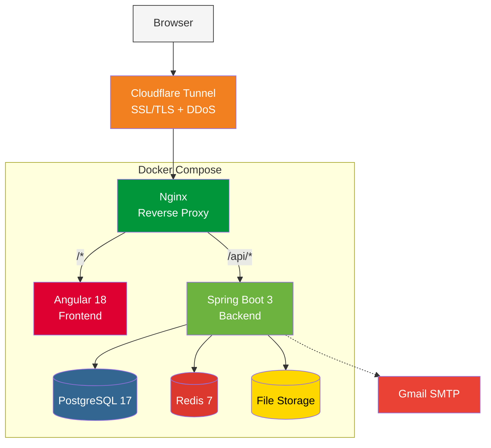

# Portfolio Application

Full-stack web application with Angular, Spring Boot, and PostgreSQL.

**[Website](https://emmanuelgabe.com)** | **[Admin Demo](https://emmanuelgabe.com/admindemo)**

## Preview


## Status

[![Backend][backend-badge]][backend-url]
[![Frontend][frontend-badge]][frontend-url]
[![CI/CD][cicd-badge]][cicd-url]
[![codecov][codecov-badge]][codecov-url]
[![Quality Gate][sonar-gate-badge]][sonar-url]
[![Security][sonar-sec-badge]][sonar-url]

## Features

- **Portfolio** - Showcase projects with images, tags, and tech stack
- **Blog** - Markdown articles with syntax highlighting and reading time
- **Timeline** - Professional experiences (work, education, certifications)
- **Contact** - Rate-limited contact form with email notifications
- **Admin Panel** - Full CMS for managing all content
- **Authentication** - JWT-based auth with automatic token refresh

---

## Architecture



### Technology Stack

**Frontend:**

![Angular][angular-badge]
![TypeScript][ts-badge]
![Bootstrap][bootstrap-badge]
![RxJS][rxjs-badge]

**Backend:**

![Spring Boot][spring-badge]
![Java][java-badge]
![Spring Security][security-badge]
![Spring Data JPA][jpa-badge]
![Lombok][lombok-badge]
![MapStruct][mapstruct-badge]
![Flyway][flyway-badge]
![Redis][redis-badge]

**Database:**

![PostgreSQL][postgres-badge]

**Infrastructure:**

![Docker][docker-badge]
![Nginx][nginx-badge]
![GitHub Actions][gha-badge]

---

## Quick Start

**Prerequisites:** Docker, Docker Compose, Git

```bash
# 1. Clone repository
git clone https://github.com/emmanuelgabe/portfolio.git
cd portfolio

# 2. Create environment file
echo "DB_USER_PASSWORD=your_secure_password" > .env

# 3. Start all services
docker-compose -f docker-compose.yml -f docker-compose.local.yml up --build -d

```

For detailed setup instructions, see [Setup Guide](./docs/development/setup.md).

---

## Environment Variables

| Variable | Description | Required |
|----------|-------------|----------|
| `DB_USER_PASSWORD` | PostgreSQL password | Yes |
| `JWT_SECRET` | JWT signing key (min 43 chars) | Production |
| `ADMIN_PASSWORD_HASH` | BCrypt hash for admin password | Production |
| `MAIL_USERNAME` | Gmail address for contact form | Optional |
| `MAIL_APP_PASSWORD` | Gmail app password | Optional |

See [Setup Guide](./docs/development/setup.md) for detailed configuration.

---

## Contact

**Emmanuel Gabe** - contact@emmanuelgabe.com

<!-- Status Badges -->
[backend-badge]: https://github.com/emmanuelgabe/portfolio/actions/workflows/backend-tests.yml/badge.svg
[backend-url]: https://github.com/emmanuelgabe/portfolio/actions/workflows/backend-tests.yml
[frontend-badge]: https://github.com/emmanuelgabe/portfolio/actions/workflows/frontend-tests.yml/badge.svg
[frontend-url]: https://github.com/emmanuelgabe/portfolio/actions/workflows/frontend-tests.yml
[cicd-badge]: https://github.com/emmanuelgabe/portfolio/actions/workflows/ci-cd.yml/badge.svg
[cicd-url]: https://github.com/emmanuelgabe/portfolio/actions/workflows/ci-cd.yml

<!-- Quality Badges -->
[codecov-badge]: https://codecov.io/gh/emmanuelgabe/portfolio/branch/main/graph/badge.svg
[codecov-url]: https://codecov.io/gh/emmanuelgabe/portfolio
[sonar-gate-badge]: https://sonarcloud.io/api/project_badges/measure?project=emmanuelgabe_portfolio&metric=alert_status
[sonar-sec-badge]: https://sonarcloud.io/api/project_badges/measure?project=emmanuelgabe_portfolio&metric=security_rating
[sonar-url]: https://sonarcloud.io/summary/new_code?id=emmanuelgabe_portfolio

<!-- Tech Stack Badges -->
[angular-badge]: https://img.shields.io/badge/Angular-18%20LTS-DD0031?logo=angular&logoColor=white
[ts-badge]: https://img.shields.io/badge/TypeScript-5.5-3178C6?logo=typescript&logoColor=white
[bootstrap-badge]: https://img.shields.io/badge/Bootstrap-5.3.3-7952B3?logo=bootstrap&logoColor=white
[rxjs-badge]: https://img.shields.io/badge/RxJS-B7178C?logo=reactivex&logoColor=white
[spring-badge]: https://img.shields.io/badge/Spring%20Boot-3.5.5-brightgreen?logo=springboot&logoColor=white
[java-badge]: https://img.shields.io/badge/Java-21-ED8B00?logo=openjdk&logoColor=white
[security-badge]: https://img.shields.io/badge/Spring%20Security-6DB33F?logo=springsecurity&logoColor=white
[jpa-badge]: https://img.shields.io/badge/Spring%20Data%20JPA-6DB33F?logo=spring&logoColor=white
[lombok-badge]: https://img.shields.io/badge/Lombok-Latest-BC4521?logo=lombok&logoColor=white
[mapstruct-badge]: https://img.shields.io/badge/MapStruct-1.6.3-orange?logoColor=white
[flyway-badge]: https://img.shields.io/badge/Flyway-Migrations-CC0200?logo=flyway&logoColor=white
[redis-badge]: https://img.shields.io/badge/Redis-Cache-DC382D?logo=redis&logoColor=white
[postgres-badge]: https://img.shields.io/badge/PostgreSQL-17-316192?logo=postgresql&logoColor=white
[docker-badge]: https://img.shields.io/badge/Docker-Compose-2496ED?logo=docker&logoColor=white
[nginx-badge]: https://img.shields.io/badge/Nginx-009639?logo=nginx&logoColor=white
[gha-badge]: https://img.shields.io/badge/GitHub%20Actions-2088FF?logo=githubactions&logoColor=white
