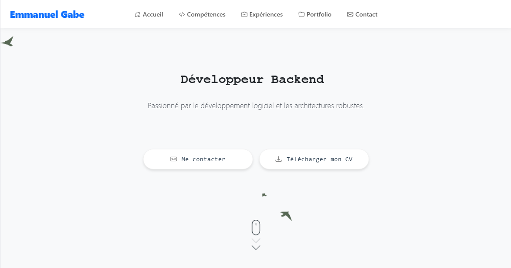
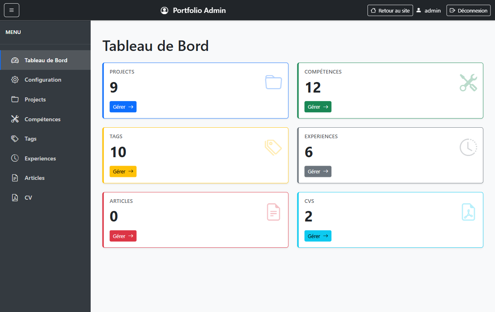
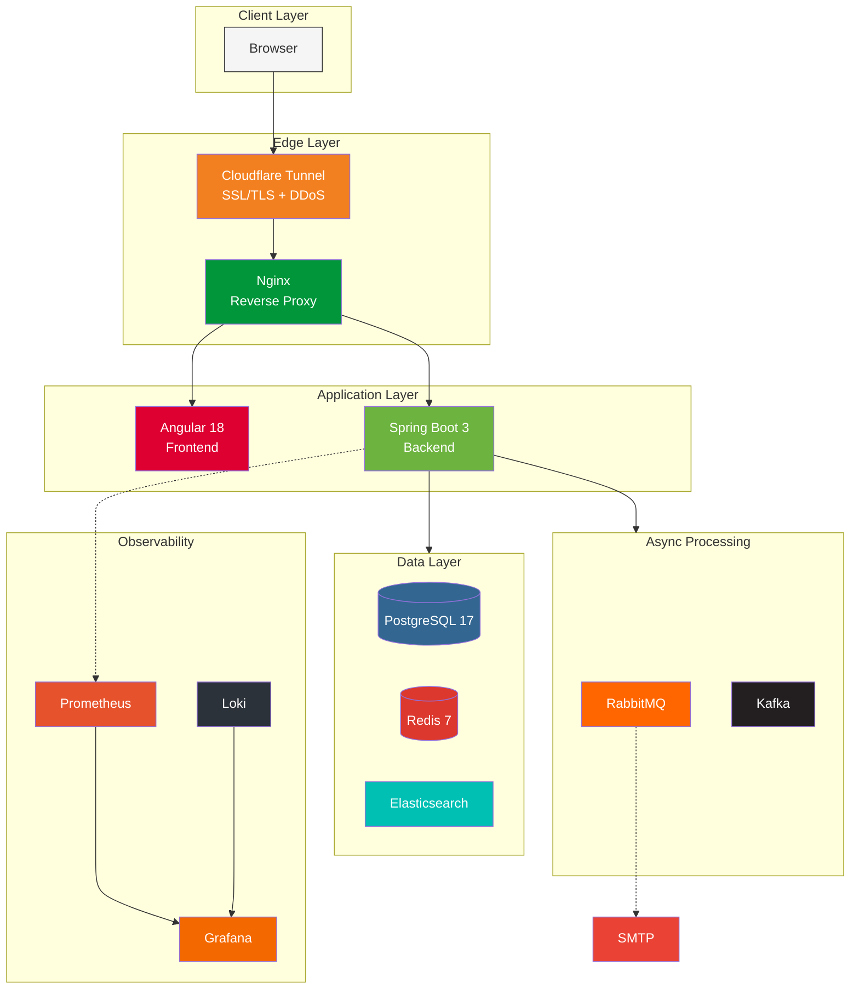

# Portfolio Application

Full-stack web application with Angular, Spring Boot, and PostgreSQL.

**[Website](https://emmanuelgabe.com)** | **[Admin Demo](https://emmanuelgabe.com/admindemo)**

## Preview

## Status

[![Backend][backend-badge]][backend-url]
[![Frontend][frontend-badge]][frontend-url]
[![CI/CD][cicd-badge]][cicd-url]
[![codecov][codecov-badge]][codecov-url]
[![Quality Gate][sonar-gate-badge]][sonar-url]
[![Security][sonar-sec-badge]][sonar-url]

## Features

**Core Features:**
- **Portfolio** - Showcase projects with images, tags, and tech stack
- **Blog** - Markdown articles with syntax highlighting and reading time
- **Timeline** - Professional experiences (work, education, certifications)
- **Contact** - Rate-limited contact form with email notifications
- **Admin Panel** - Full CMS for managing all content
- **Authentication** - JWT-based auth with automatic token refresh

**Advanced Features:**
- **Messaging** - Async email and image processing via RabbitMQ
- **Event Streaming** - Admin events and analytics via Apache Kafka
- **Audit Trail** - Complete admin action logging with CSV/JSON export
- **Full-text Search** - Elasticsearch with JPA fallback
- **GraphQL API** - Alternative to REST with Relay pagination
- **Batch Jobs** - 6 scheduled jobs (cleanup, reports, stats, sitemap, reindex)
- **Real-time Analytics** - SSE active users, visitor tracking
- **Circuit Breaker** - Resilience4j for external services
- **Observability** - Prometheus, Grafana dashboards, Loki logs, Alertmanager
- **PWA** - Offline support with Service Worker
- **i18n** - 10 languages with RTL support

---

## Architecture

### Technology Stack

**Frontend:**

![Angular][angular-badge]
![TypeScript][ts-badge]
![Bootstrap][bootstrap-badge]
![RxJS][rxjs-badge]

**Backend:**

![Spring Boot][spring-badge]
![Java][java-badge]
![Spring Security][security-badge]
![Spring Data JPA][jpa-badge]
![Lombok][lombok-badge]
![MapStruct][mapstruct-badge]
![Flyway][flyway-badge]
![Redis][redis-badge]
![RabbitMQ][rabbitmq-badge]
![Kafka][kafka-badge]
![GraphQL][graphql-badge]
![Resilience4j][resilience4j-badge]

**Database & Search:**

![PostgreSQL][postgres-badge]
![Elasticsearch][elasticsearch-badge]

**Infrastructure:**

![Docker][docker-badge]
![Nginx][nginx-badge]
![GitHub Actions][gha-badge]

**Observability:**

![Prometheus][prometheus-badge]
![Grafana][grafana-badge]
![Loki][loki-badge]

---

## Documentation

- [Setup Guide](./docs/development/setup.md) - Installation and configuration
- [API Reference](./docs/api/README.md) - REST and GraphQL endpoints
- [Architecture](./docs/architecture/README.md) - System design and database schema
- [Features](./docs/features/README.md) - Detailed feature documentation

---

## Contact

**Emmanuel Gabe** - contact@emmanuelgabe.com

<!-- Status Badges -->
[backend-badge]: https://github.com/emmanuelgabe/portfolio/actions/workflows/backend-tests.yml/badge.svg
[backend-url]: https://github.com/emmanuelgabe/portfolio/actions/workflows/backend-tests.yml
[frontend-badge]: https://github.com/emmanuelgabe/portfolio/actions/workflows/frontend-tests.yml/badge.svg
[frontend-url]: https://github.com/emmanuelgabe/portfolio/actions/workflows/frontend-tests.yml
[cicd-badge]: https://github.com/emmanuelgabe/portfolio/actions/workflows/ci-cd.yml/badge.svg
[cicd-url]: https://github.com/emmanuelgabe/portfolio/actions/workflows/ci-cd.yml

<!-- Quality Badges -->
[codecov-badge]: https://codecov.io/gh/emmanuelgabe/portfolio/branch/main/graph/badge.svg
[codecov-url]: https://codecov.io/gh/emmanuelgabe/portfolio
[sonar-gate-badge]: https://sonarcloud.io/api/project_badges/measure?project=emmanuelgabe_portfolio&metric=alert_status
[sonar-sec-badge]: https://sonarcloud.io/api/project_badges/measure?project=emmanuelgabe_portfolio&metric=security_rating
[sonar-url]: https://sonarcloud.io/summary/new_code?id=emmanuelgabe_portfolio

<!-- Tech Stack Badges -->
[angular-badge]: https://img.shields.io/badge/Angular-18%20LTS-DD0031?logo=angular&logoColor=white
[ts-badge]: https://img.shields.io/badge/TypeScript-5.5-3178C6?logo=typescript&logoColor=white
[bootstrap-badge]: https://img.shields.io/badge/Bootstrap-5.3.3-7952B3?logo=bootstrap&logoColor=white
[rxjs-badge]: https://img.shields.io/badge/RxJS-B7178C?logo=reactivex&logoColor=white
[spring-badge]: https://img.shields.io/badge/Spring%20Boot-3.5.5-brightgreen?logo=springboot&logoColor=white
[java-badge]: https://img.shields.io/badge/Java-21-ED8B00?logo=openjdk&logoColor=white
[security-badge]: https://img.shields.io/badge/Spring%20Security-6DB33F?logo=springsecurity&logoColor=white
[jpa-badge]: https://img.shields.io/badge/Spring%20Data%20JPA-6DB33F?logo=spring&logoColor=white
[lombok-badge]: https://img.shields.io/badge/Lombok-Latest-BC4521?logo=lombok&logoColor=white
[mapstruct-badge]: https://img.shields.io/badge/MapStruct-1.6.3-orange?logoColor=white
[flyway-badge]: https://img.shields.io/badge/Flyway-Migrations-CC0200?logo=flyway&logoColor=white
[redis-badge]: https://img.shields.io/badge/Redis-Cache-DC382D?logo=redis&logoColor=white
[rabbitmq-badge]: https://img.shields.io/badge/RabbitMQ-FF6600?logo=rabbitmq&logoColor=white
[kafka-badge]: https://img.shields.io/badge/Apache%20Kafka-231F20?logo=apachekafka&logoColor=white
[graphql-badge]: https://img.shields.io/badge/GraphQL-E10098?logo=graphql&logoColor=white
[resilience4j-badge]: https://img.shields.io/badge/Resilience4j-Circuit%20Breaker-00B4AB
[elasticsearch-badge]: https://img.shields.io/badge/Elasticsearch-005571?logo=elasticsearch&logoColor=white
[postgres-badge]: https://img.shields.io/badge/PostgreSQL-17-316192?logo=postgresql&logoColor=white
[docker-badge]: https://img.shields.io/badge/Docker-Compose-2496ED?logo=docker&logoColor=white
[nginx-badge]: https://img.shields.io/badge/Nginx-009639?logo=nginx&logoColor=white
[gha-badge]: https://img.shields.io/badge/GitHub%20Actions-2088FF?logo=githubactions&logoColor=white
[prometheus-badge]: https://img.shields.io/badge/Prometheus-E6522C?logo=prometheus&logoColor=white
[grafana-badge]: https://img.shields.io/badge/Grafana-F46800?logo=grafana&logoColor=white
[loki-badge]: https://img.shields.io/badge/Loki-2C3239?logo=grafana&logoColor=white
